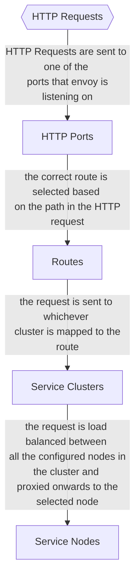
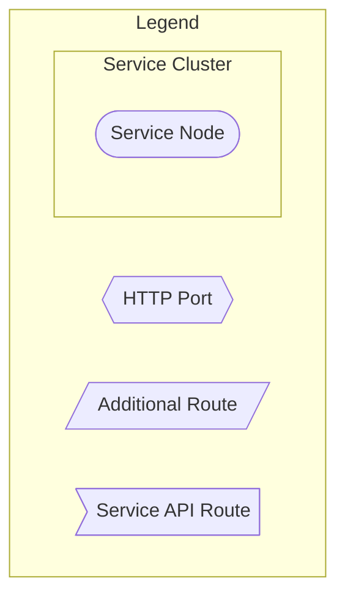
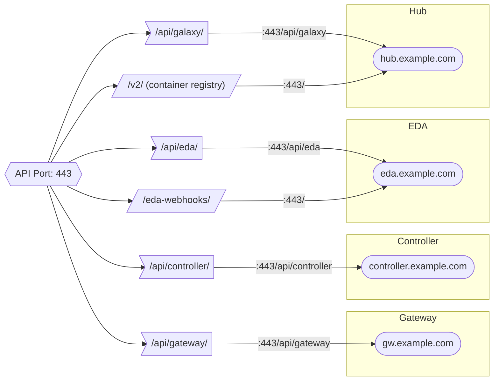
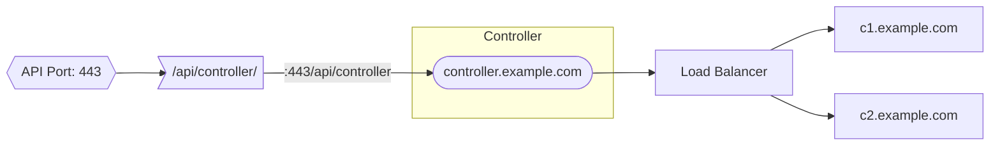
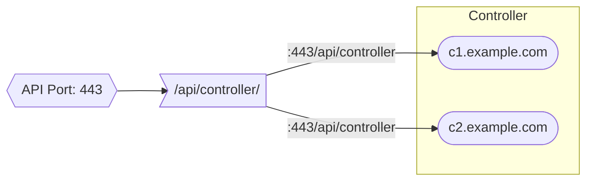
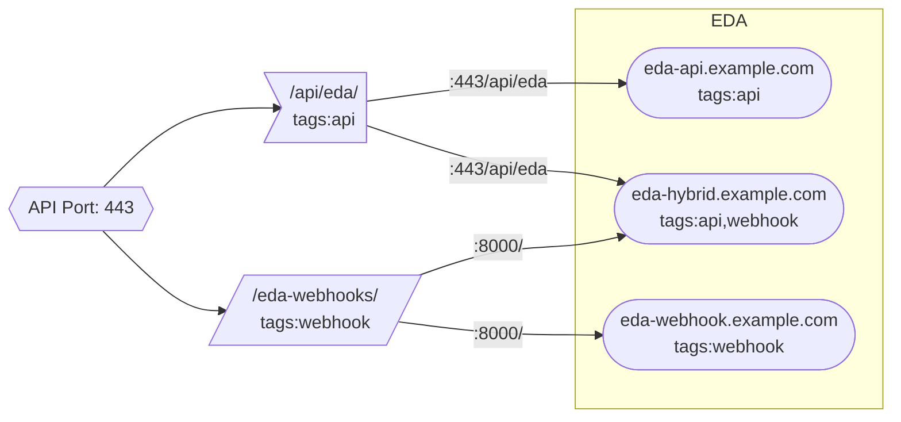
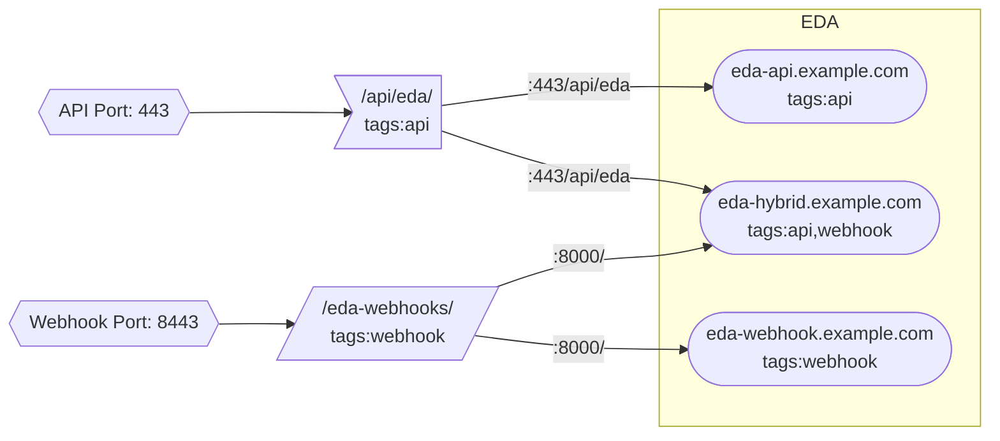

# Configuring Envoy Routing

There are four core items in the Gateway proxy configuration. These are:

## HTTP Ports

This defines the ports that envoy will listen for traffic on (such as 80 and 443)

- Module: `ansible.platform.http_ports`
- API Endpoint: `/api/gateway/v1/http_ports/`
- Django Model: `aap_gateway_api.models.HTTPPort`

Fields:

- `name`: unique human readable name.
- `number`: port number for Envoy to listen to requests on.
- `use_https`: secure this port with HTTPS.
- `is_api_port`: indicates that this port will be used to serve all of the `/api/` paths (`/api/controller/`, `/api/gateway/`, etc.)

## Service Clusters

Clusters are a logical grouping of nodes that represent a specific service. As of AAP 2.5, this includes Gateway, Controller, EDA and Hub.

- Module: `ansible.platform.service_clusters`
- API Endpoint: `/api/gateway/v1/service_clusters/`
- Django Model: `aap_gateway_api.models.ServiceCluster`

Fields:

- `name`: unique human readable name.
- `service_type`: type of cluster (eda, hub, gateway, controller).
- There are a bunch of settings here for configuring load balancing in Envoy. The defaults here should be good enough for most deployments.

## Service Nodes

Nodes represent an individual server, VM, container within a service cluster where the one of the services is running.

- Module: `ansible.platform.service_nodes`
- API Endpoint: `/api/gateway/v1/service_nodes/`
- Django Model: `aap_gateway_api.models.ServiceNode`

Fields:

- `name`: unique human readable name.
- `address`: DNS or IP address where envoy can proxy requests to. In most cases this needs to be reachable over the network, however for single node Gateway clusters, this could be localhost or a socket.
- `tags`: list of values which indicate what web services are available on this node.
- `service_cluster`: reference to the service cluster that this node is a part of.

## Routes

Routes represent a path on one of the configured HTTP Ports where Envoy will listen for network requests. Routes are proxied to a single ServiceCluster, where they are load balanced between a user specified set of nodes in the cluster. Routes are never configured directly. Instead they contain two subtypes.

Common Fields:

- `name`: unique human readable name.
- `http_port`: reference to the HTTP Port object where this route will listen on.
- `service_cluster`: reference to the service cluster that this route will send traffic to.
- `service_port`: this is the port on the service node where the traffic from this route will get sent to.
- `is_service_https`: indicate whether the service cluster is using HTTP. or not. This tells envoy if it needs to proxy the request using HTTP or HTTPS. Envoy will handle SSL termination either way.
- `service_path`: path on the service node to proxy the request to.
- `gateway_path`: path on the Gateway that envoy will use to match requests for this route.
- `enable_gateway_auth`: if this is false, envoy will not try to authenticate the request. If it is true, envoy will attempt to authenticate the request, but won't block unauthenticated requests from being proxied to the service.
- `order`: order in which the route should be resolved in. This determines precedence if two paths overlap.
- `node_tags`: determines the set of nodes in the service cluster to send requests to.
- `enable_mtls`: sets mutual tls on the route.

### Route Examples

Routes are the most complicated object to understand, so we'll explore some example Routes using the following service cluster:

Service Cluster: EDA
Nodes:

- webhook.eda.com, tags: webhook
- api.eda.com, tags: api

**Example Route 1:**

```yaml
service_port: 443
node_tags: ""
service_path: "/api/"
gateway_path: "/api/eda/"
enable_gateway_auth: true
is_service_https: true
```

This route will match any request on the Gateway at `/api/eda/` and proxy them to both of the configured EDA nodes (webhook.eda.com and api.eda.com). In this case, the service port is 443 and service path is `/api/`, so all requests proxied through this route will go to one of the following URLs:

- `https://webhook.eda.com:443/api/`
- `https://api.eda.com:443/api/`

The urls that are proxied for a route are formatted something like this: `{"https" if is_service_https else "http"}://{node_address}:{service_port}/{service_path}`.

Note that one limitation of the current configuration is that all nodes configured for a route must all use the same protocol (http or https), port and path. You can't have a route that sends traffic to port 1234 on node1 and 4321 on node2.

In this example, `is_service_https` is set to true, so the gateway will be checking authentication headers on every request.

**Example Route 2:**

```yaml
service_port: 8000
node_tags: "webhook"
service_path: "/"
gateway_path: "/eda-webhooks/"
enable_gateway_auth: false
is_service_https: false
```

This route will only send traffic to the following URL:

- `http://webhook.eda.com:8000/`

We used `http` as the protocol, because of `is_service_https: false`, `/` for the path because of `service_path: "/"` and `8000` for the port because of `service_port: 8000`.

In this case we're only routing to `webhook.eda.com` because of the `node_tags: "webhook"`.

**Example Route 3:**

```yaml
service_port: 8000
node_tags: "webhook,api"
service_path: "/"
gateway_path: "/eda-webhooks/"
enable_gateway_auth: false
is_service_https: false
```

This route is identical to the previous example, except we are also selecting the `api` nodes as well. It will result in load balancing requests to `/eda-webhooks/` on gateway between the following urls:

- `http://webhook.eda.com:8000/`
- `http://api.eda.com:8000/`

### Service API Routes

Service API Routes: these are routes that live on the `/api/` base path. They must all be served from the same HTTP Port, which is tagged with the `is_api_port` flag. The path for these routes must follow the `/api/<service_slug/` pattern.

- Module: `ansible.platform.services`
- API Endpoint: `/api/gateway/v1/services/`
- Django Model: `aap_gateway_api.models.ServiceAPIRoute`

Fields:

- `api_slug`: this replaces the `gateway_path` field on the normal Route model. The path for service API routes will always be `/api/<api_slug>/`.

### Additional Routes

Additional routes encompass every other potential API route in Gateway. This includes things like the container registry in Hub, static files and eda webhooks. They can be served from the API port, or any other configured port. The main requirement with these routes is that they cannot be served from the `/api` path on the API port.

- Module: `ansible.platform.routes`
- API Endpoint: `/api/gateway/v1/routes/`
- Django Model: `aap_gateway_api.models.AdditionalRoute`

## Putting it All together

These objects all interact with each other when requests are received by the Gateway as follows:



### Examples

For the examples will be using this as the legend:



#### Basic Single Node Deployment With all Services

Gateway Nodes:

- gw.example.com

Controller Nodes:

- controller.example.com

EDA Nodes:

- Webhook: eda.example.com
- API: eda.example.com

Hub Nodes:

- API: hub.example.com



#### Upgraded 2.4 HA Cluster

For this scenario we will have multiple controller nodes behind a load balancer. In this case, while controller has multiple physical nodes, we only configure one one node in controller, which will be for the load balancer.

Controller Nodes:

- Behind Load Balancer:
  - c1.example.com
  - c2.example.com
- Load Balancer: controller.example.com



#### Load Balancing Through Envoy

Controller Nodes:

- c1.example.com
- c2.example.com



#### Nodes with Different Tags

Nodes and routes can be tagged with arbitrary values that allows a route to only send traffic to a subset of the configured service nodes. In this example, the EDA nodes can service API or webhook traffic.

EDA Nodes:

- Hybrid: eda-hybrid.example.com
- API: eda-api.example.com
- Webhook: eda-webhook.example.com



#### Multiple Ports

This is the same example as above, except EDA webhooks are served on a separate port.

EDA Nodes:

- Hybrid: eda-hybrid.example.com
- API: eda-api.example.com
- Webhook: eda-webhook.example.com


