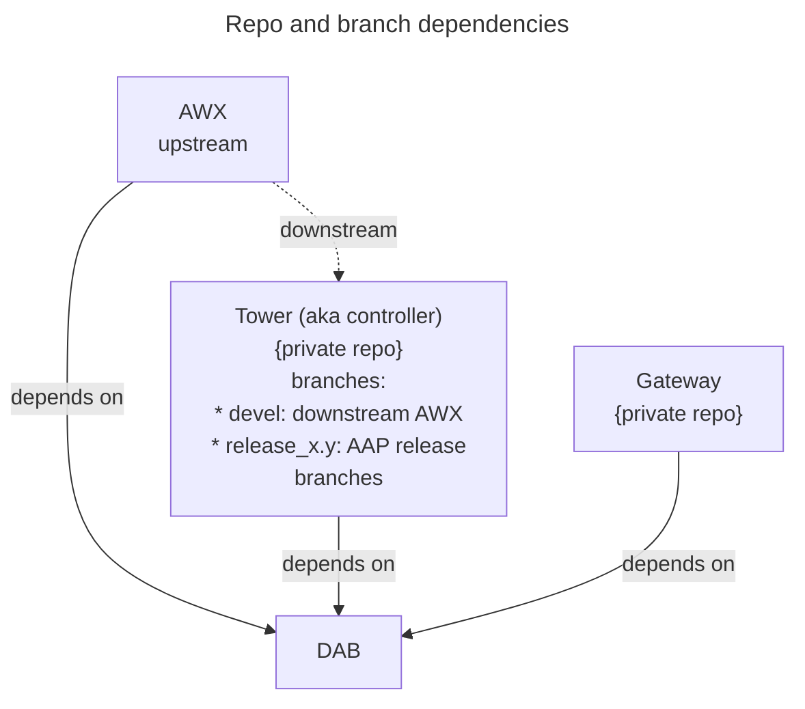

# Gateway development

- GitHub org: `ansible`
- Main GIT branch: `devel`
- Docker Python version: `3.12`
- Python dependencies specified by requirements.txt (updater.sh)
- Project is using Makefile

## Assumptions

All repositories are cloned to the `<your-path>/aap` folder, hereinafter referred to as `aap folder`.

## Repositories

- https://github.com/ansible/aap-gateway/ (required)
- https://github.com/ansible/django-ansible-base/ (aka DAB)
  - clone as aap-gateway's subdirectory
- https://github.com/ansible/aap-gateway-service-lib


## Installation
### Before installation

Login to quay.io for download docker image https://quay.io/ansible/platform-ui
- Requires `quay.io` invitation to “aapgateway” group to see `ansible` organization

Alternatively you can clone https://github.com/ansible/aap-ui.git locally,
and run the image build steps, then set the tag locally.

```bash
npm ci
cd platform
npm run build
cd ..
docker build --file platform/Dockerfile --target platform-ui --tag platform-ui .
docker image tag platform-ui:latest quay.io/ansible/platform-ui:latest
```

Then in aap-gateway you will have to create the file to keep it from trying to build.

```
touch tools/generated/.has_built_ui
```

These steps will be subject to change later.

### Main installation

- Follow the [Readme](#project-installation-docs)
- Update content of `proxy.yml`:
```yaml
services:
  gateway:
    use_tls: true
    api_port: 8000
    control_plane_port: 50051
    service_root: /
    type: gateway
    order: 100
    nodes:
      - address: "gateway"

  hub:
    use_tls: false
    service_root: /api/hub/
    api_port: 5001
    type: hub
    order: 1
    nodes:
      - address: "localhost"

  controller:
    use_tls: true
    service_root: /api/
    api_port: 8043
    type: controller
    order: 2
    nodes:
      - address: "localhost"

  eda:
    use_tls: false
    service_root: /api/eda/
    api_port: 8010
    type: eda
    order: 3
    nodes:
      - address: "localhost"

```

### Virtual env

**Prerequisites**

Global:
- `sudo dnf install gcc openssl-devel bzip2-devel libffi-devel zlib-devel wget make`

**Installation**

- `mkdir -p <aap folder>/venv`
- `python -m venv <aap folder>/venv/aap-gateway`
- `source <aap folder>/venv/aap-gateway/bin/activate`
- `pip install -r requirements/requirements_dev.txt`

### Project Installation Docs

- https://github.com/ansible/aap-gateway/blob/devel/README.md

## Run

- `make docker-compose`

## API/UI/Credentials:

see [main development page](../development.md)


## Development

This section describes various aspects of the AAP Gateway development that might not be obvious or need special attention.

### Adding/upgrading dependencies

Following diagram shows repositories that need to be considered when adding or upgrading dependencies of AAP DAB and Gateway components.



Based on the diagram above, it is clear that:

* all dependencies in all the repositories must be compatible
  * DAB can not require library X of version 2.x if AWX requires the same library of version <= 1.x
  * Gateway can require additional libraries that AWX or DAB do not use

#### Limitations

The diagram above shows the relations ship between repositories however the AAP components are built by productization process that imposes a limitation that can not be shown in the diagram:

* All dependencies available for building AAP components, DAB and Gateway, are being built from Tower set of dependencies. In other words, any upgrade of a dependency for DAB has to be done at Tower repository first.

### Dependency upgrade process

There are different reasons for upgrading a dependency, most likely to either add a library needed for new feature of a fix or to pickup newer version of a library that includes a CVE(vulnerability) fix. In either case, the process is mostly the same.

1. Identify whether the library is common to AWX/Tower, DAB and Gateway or is used only in Gateway. If it is only used in Gateway, the process is a simple update of the requirements file.
2. If the library is used in DAB and AWX/Tower, the upgrade process must start at Tower. The reason for upgrading the requirements file at Tower repo first is driven by the productization process. Ansible Automaton Platform controller component is built by the productization process from Tower repository and this  process produces RPMs for each tower dependencies which can than be "required" by other AAP components (this only applies to dependencies that are required by Tower, dab and gateway, for example `django`.).
   * There are different branches that need to be updated, usually just two of the currently supported releases of AAP. However, the branch names in Tower repository do not match AAP releases:
      * Branch `release_4.5` corresponds to AAP release 2.4
      * Branch `release_4.6` corresponds to AAP release 2.5
3. Once a PR(pull request) for adding or upgrading dependency is reviewed and merged, check the URL below to verify that the dependency, at a specific version, has been actually built:
    * Ansible tower nightlies: <http://nightlies.testing.ansible.com/ansible-tower_nightlies_m8u16fz56qr6q7/dependencies/2.5/epel-9-x86_64/>
4. At this point a dependency can be added or upgraded within DAB or Gateway repositories via PR in their respective repositories.

#### Updating requirements files

There are two types of requirements file, an `.in` file and `.txt` which is generated from the `.in` file. Detailed description of how to use the files is documented here: <https://github.com/ansible/awx/tree/devel/requirements#dependency-management>

##### Versioning constraints

In order to allow upgrading the newer versions of dependencies for all AAP components, the requirements files will use a version specification that can be satisfied by range of versions. For example:
```
Django>=5.2.8,<5.3
```
Where possible, it is preferable to use more restricted version ranges in Tower repository and more relaxed version ranges in DAB and Gateway. With this approach, the DAB and Gateway can pickup new dependency versions when Tower upgrades theirs. This might not always be possible or desired, especially when depenency versions are upgraded to pickup security fixes.


