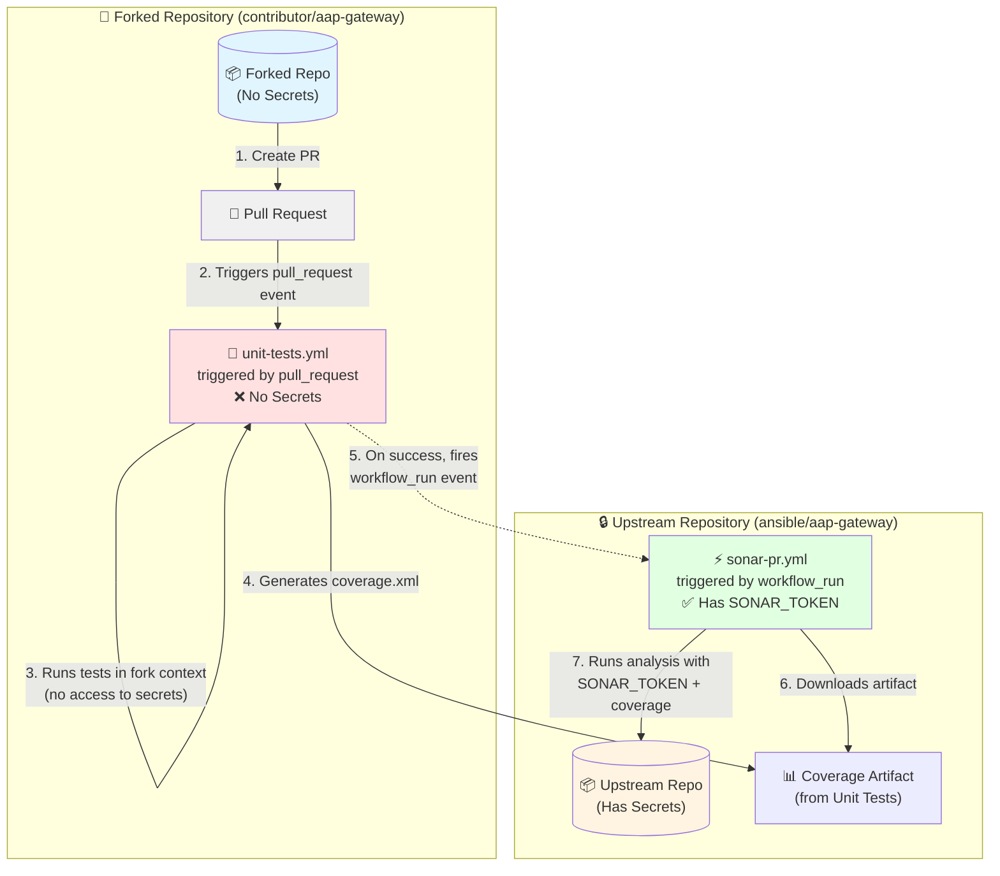

# SonarQube Cloud in AAP-Gateway

SonarQube Cloud (formerly known as SonarCloud) is a **Software-as-a-Service (SaaS)** code analysis tool that helps maintain high-quality code by identifying issues related to maintainability, reliability, and security. 

We use SonarQube Cloud to perform code analysis on main branch, pull and push requests to ensure a certain level of code coverage and compliance with quality code standards.

## 🔹 Core Concepts in SonarQube Cloud

1. **Clean as You Code**:
A development practice ensuring that **new code** complies with quality standards.  

2. **Clean Code Attributes**: Consistency, Intentionality, Adaptability and Responsibility.
    - 📚 [Code analysis metrics](https://docs.sonarsource.com/sonarqube-cloud/digging-deeper/metric-definitions/)

3. **Software Quality**: SonarQube Cloud assesses software quality by detecting issues that violate clean code principles. Each issue impacts one or more software qualities with varying severity.  
    - 📚 [Code analysis based on clean code](https://docs.sonarsource.com/sonarqube-cloud/core-concepts/clean-code/code-analysis/)

4. **Quality Standards**: is made up of a quality profile and a quality gate.
    - *Quality Profile* – A set of rules applied during analysis.  
    - *Quality Gate* – A set of conditions that must be met for the code to pass code quality standards. 
   The gate shows pass (green) or fail (red) status based on whether all conditions are met or if any condition is not met. 


## 🔍 SonarQube Cloud  Analysis Methods

For **GitHub repositories**, SonarQube Cloud supports two analysis methods:

### 1️⃣ [**Automatic Analysis**](https://docs.sonarsource.com/sonarqube-cloud/advanced-setup/automatic-analysis/)  
- Requires no configuration in the repository.  
- Analysis runs directly on **SonarCloud’s platform**.  

- ❌ **Limitations**:
  - Not all repositories qualify.
  - Branch analysis of non-pull request branches other than the main branch is not supported.
  - Code coverage information is not supported.
- Example: `ansible/awx` uses **automatic analysis**.

### 2️⃣ [**CI-Based Analysis**](https://docs.sonarsource.com/sonarqube-cloud/advanced-setup/ci-based-analysis/overview-of-integrated-cis/)

- *SonarScanner* is installed as part of the build process and performs the actual code analysis in the build environment. 
- Provides customized configuration options.
- To include [***code coverage***](https://docs.sonarsource.com/sonarqube-cloud/enriching/test-coverage/overview/): A code coverage tool needs to be set up and run *before* the SonarScanner analysis step so that Sonar can import the code coverage report files.  
- Results are uploaded to SonarCloud after execution.

## ⚙️ How SonarCloud is Configured in AAP-Gateway

AAP-Gateway uses CI-based analysis with GitHub Actions (GHA) to integrate SonarCloud while incorporating code coverage data.

> [!NOTE]
> Some of the links below require authentication to SonarCloud. If you see a blank page after clicking a link, use the login option in the upper right corner. If the page remains blank, you may not have permission to view the data.

### 🔹 AAP-Gateway Quality Standards:
AAP-Gateway uses the default "Sonar Way" Quality Profile and applies a Quality Gate to enforce coding standards.
This ensures that any introduced changes meet defined thresholds for maintainability, reliability, and security.

- 📚 [aap-gateway Quality Profile](https://sonarcloud.io/project/information?id=ansible_aap-gateway)
- 📚 [aap-gatewat Quality Gate](https://sonarcloud.io/organizations/ansible/quality_gates/show/118786)

### 🔹 Project Analysis Configuration and Parameters:
In general, project analysis settings can be configured in 3 different places: in the UI, in a configuration file, or on the command line.

For CI-based analysis, parameters can be set in the `sonar-project.properties` file.

- 📚 [aap-gateway `sonar-project.properties`](https://github.com/ansible/aap-gateway/blob/devel/sonar-project.properties)
- 📚 [Setting configuration with analysis parameters](https://docs.sonarsource.com/sonarqube-cloud/advanced-setup/analysis-parameters/#setting-configuration-in-a-file)

> [!WARNING] 
> If changes to `sonar-project.properties` break SonarCloud, the PR may still appear **green** since Sonar doesn't inject itself in such cases.

## 📌 GitHub Actions Integration  
There are two GitHub Actions workflows that handle the integration of SonarCloud into the AAP-Gateway CI/CD pipeline:  

SonarCloud analysis on PRs to private repositories requires a special setup because PR workflows don't have access to secrets. To solve this, we trigger the SonarCloud workflow (`sonar-pr.yml`) after the Unit Tests workflow completes. This workflow runs in the upstream repository context, so it has access to the necessary secrets and can report results back to the PR.

### 🔹 **1. Unit Tests Workflow**
File: [`.github/workflows/unit-tests.yml`](https://github.com/ansible/aap-gateway/blob/devel/.github/workflows/unit-tests.yml)
Trigger: Runs on pull requests and push to `devel`/`stable-*` branches

- The Unit Tests workflow runs tests in parallel batches using `tox` with `pytest` and `pytest-cov`
- Each batch generates its own coverage report: `coverage-views.xml`, `coverage-service.xml`, `coverage-remaining.xml`
- For PRs, the PR number is injected into each coverage file as an XML comment for later extraction
- All individual coverage artifacts are uploaded separately to preserve parallel test results
- Triggers the SonarCloud workflow via `workflow_run` event upon successful completion

📚 GitHub Docs: [Storing & Sharing Data from a Workflow](https://docs.github.com/en/actions/writing-workflows/choosing-what-your-workflow-does/storing-and-sharing-data-from-a-workflow)

### 🔹 **2. SonarCloud Analysis Workflow**
File: [`.github/workflows/sonar-pr.yml`](https://github.com/ansible/aap-gateway/blob/devel/.github/workflows/sonar-pr.yml)  
Trigger: Runs after the Unit Tests workflow successfully completes (via `workflow_run`)  

This workflow is split into two focused jobs for better maintainability:

#### **Job 1: sonar-pr-analysis** (for PRs)
- Triggered when Unit Tests completes on `pull_request` events
- Downloads all individual coverage artifacts (`coverage-*.xml`) from the Unit Tests workflow
- Extracts PR number from coverage files (injected by Unit Tests workflow)
- Retrieves PR metadata (base branch, head branch) via GitHub API
- Fetches list of all changed files in the PR
- Runs SonarCloud PR analysis on all changed files (Python, YAML, JSON, Markdown, etc.)
- Passes all coverage files to SonarCloud for comprehensive coverage reporting
- Quality gate focuses on new/changed code in the PR

#### **Job 2: sonar-branch-analysis** (for long-lived branches)
- Triggered when Unit Tests completes on `push` events to `devel`/`stable-*`
- Downloads all individual coverage artifacts (`coverage-*.xml`) from the Unit Tests workflow
- Runs SonarCloud branch analysis on the full codebase
- Passes all coverage files to SonarCloud for comprehensive coverage reporting
- Quality gate focuses on overall project health

**Key Benefits:**
- ✅ **Eliminates coverage race conditions** - SonarCloud always runs after tests complete
- ✅ **Sequential execution** - Coverage data is always available when analysis runs  
- ✅ **Focused jobs** - Clear separation between PR analysis and branch analysis
- ✅ **Improved reliability** - No more missing coverage data on branch pushes
- ✅ **Better maintainability** - Simpler conditional logic within each job


> [!NOTE]
> **Why `workflow_run` Instead of Direct Triggers?**
> 
> Our architecture uses `workflow_run` exclusively to trigger SonarCloud analysis, which provides several key benefits:
>
> **Security:** GitHub Actions workflows triggered by `pull_request` run in the context of the forked repository, which does not have access to secrets (e.g., the SonarCloud tokens). By using `workflow_run`, the SonarCloud workflow runs in the upstream repository context with access to secrets.
>
> **Reliability:** The `workflow_run` approach ensures SonarCloud analysis always runs **after** Unit Tests completes successfully, guaranteeing that coverage data is available. This eliminates race conditions that occurred with parallel execution.
>
> **Flow:**
> 1. Unit Tests workflow runs and generates coverage report
> 2. `workflow_run` event triggers SonarCloud workflow upon Unit Tests success  
> 3. SonarCloud workflow downloads coverage artifact and performs analysis
> 
> 📚 GitHub Docs: 
> - [`workflow_run` event in GitHub Actions](https://docs.github.com/en/actions/writing-workflows/choosing-when-your-workflow-runs/events-that-trigger-workflows#workflow_run)
> - [Using secrets in a workflow](https://docs.github.com/en/actions/security-for-github-actions/security-guides/using-secrets-in-github-actions#using-secrets-in-a-workflow)

### 🔹 **Workflow Architecture Diagram**

The following diagram illustrates how the fork PR workflow maintains security while enabling SonarCloud analysis:



**Key Security Boundaries:**
- 🔴 **Fork Context (No Secrets)**: Unit tests run in the fork's context where secrets are not available
- 🟢 **Upstream Context (With Secrets)**: SonarCloud runs in the upstream repository with access to SONAR_TOKEN
- 🔵 **Artifact Bridge**: Coverage data flows from fork to upstream via artifacts (safe, non-executable data)

This architecture ensures that:
- Forks cannot access sensitive tokens
- Code from forks is tested before analysis
- SonarCloud always has required credentials
- Coverage data is always available when analysis runs

 **📌 Summary: Workflow Architecture**

| **Workflow**         | **Trigger**                    | **Purpose**                | **Access to Secrets?** |
|---------------------|-------------------------------|---------------------------|------------------------|
| `unit-tests.yml`   | Push, PR                      | Run tests & generate coverage | ❌ **Not on PRs** (forks lack access) |
| `sonar-pr.yml`     | After Unit Tests completes   | SonarCloud analysis        | ✅ **Has access to secrets** |

**Flow:**
- **For PRs**: `pull_request` → `unit-tests.yml` → `workflow_run` → `sonar-pr-analysis` job  
- **For Branches**: `push` → `unit-tests.yml` → `workflow_run` → `sonar-branch-analysis` job


## 🛠️ Debugging SonarCloud Issues

### 🔹 **Common Issue: Broken `sonar-project.properties`**
If a change in `sonar-project.properties` breaks SonarCloud, debugging can be tricky since the PR may still appear **green** because Sonar doesn't inject itself in such cases. The best approach is to run **`sonar-scanner` locally**.

### 🔹 **Steps to Debug Locally**

1. **Download SonarScanner**  
📚 [SonarScanner Download](https://docs.sonarsource.com/sonarqube/9.9/analyzing-source-code/scanners/sonarscanner/)  

2. **Set up SonarScanner CLI**

   SonarScanner CLI can be used with SonarCloud to debug and configure local analysis. 
   After you have downloaded the SonarScanner archive, follow [this instructions](https://docs.sonarsource.com/sonarqube-cloud/advanced-setup/ci-based-analysis/sonarscanner-cli/) to finish the set up.
   
   > [!NOTE]
   > The extracted `sonar-scanner` files **must stay together**. You **cannot** move only `bin/sonar-scanner` to `/usr/local/bin/`.
   Instead, add the `bin` directory to `$PATH`:

      ```sh
      export PATH=$(pwd)/bin:$PATH
      ```

   > [!TIP]
   > Some of these changes were based on the SonarCloud GitHub Action: https://github.com/SonarSource/sonarcloud-github-action/blob/master/action.yml

3. **Obtain a SonarCloud API Token**
   - Log in to **SonarCloud**  
   - Click your avatar (top-right) → **My Account** → [**Security Tab**](https://sonarcloud.io/account/security)  
   - Generate a new **Sonar Token** and set it as an environment variable:

   ```sh
   export SONAR_TOKEN=your_token_here
   ```

4. **Run SonarScanner Manually**

   Run the command `sonar-scanner` from the project base directory to run the analysis
   ```sh
   sonar-scanner -Dsonar.projectBaseDir=. -Dsonar.host.url=https://sonarcloud.io
   ```

5. **Check for Errors**
   - Most issues appear at the **bottom of the output**.
   - Fix any configuration problems and rerun `sonar-scanner`.
   - You can iterate as quickly as you like, then commit the fix.

## 🔧 Automated Local Analysis Script

For easier PR analysis, we provide an automated script that uses the GitHub CLI to retrieve PR information and run the analysis with the correct parameters.

The script follows the [thenets/bash-helpers](https://github.com/thenets/bash-helpers) boilerplate pattern with structured logging, self-documenting help, and robust error handling.

### 🔹 **Quick Start**

```bash
# Setup (one-time)
export SONAR_TOKEN=your_token_here
gh auth login

# Run analysis for current PR branch
./tools/scripts/run-sonar-local.sh

# Or analyze a specific PR number
./tools/scripts/run-sonar-local.sh 123

# View comprehensive help
./tools/scripts/run-sonar-local.sh --help
```

### 🔹 **Features**

- **Auto PR Detection**: Automatically detects current PR or accepts PR number argument
- **GitHub CLI Integration**: Retrieves PR metadata (base branch, head branch, SHA) via `gh`
- **Coverage Generation**: Generates coverage.xml if missing (requires pytest)
- **Exact CI Simulation**: Uses identical sonar-scanner parameters as GitHub Actions workflow
- **Structured Logging**: Color-coded output with `[INFO]`, `[SUCCESS]`, `[WARNING]`, `[ERROR]` levels
- **Self-Documenting**: Help text extracted from script header comments
- **Prerequisite Validation**: Checks all required tools and environment variables
- **Robust Error Handling**: Clear error messages and troubleshooting guidance

### 🔹 **Requirements**

- `SONAR_TOKEN` environment variable  
- GitHub CLI (`gh`) authenticated
- `jq` for JSON parsing
- `sonar-scanner` in PATH
- Optional: `pytest` with `pytest-cov` for coverage generation

### 🔹 **Output Example**

```
---- SonarCloud Local Analysis Tool ----
[INFO ] Checking prerequisites...
[SUCCESS] All prerequisites met
[SUCCESS] Found PR #1
[INFO ]   Head branch: AAP-49383
[INFO ]   Base branch: stable-2.5
[SUCCESS] SonarCloud analysis completed successfully!
```

## 📌 References

- [SonarCloud Documentation](https://docs.sonarsource.com/sonarqube-cloud/)
- [GitHub Actions for SonarCloud](https://docs.sonarsource.com/sonarqube-cloud/advanced-setup/ci-based-analysis/github-actions-for-sonarcloud/)
- [GitHub Workflow Data Sharing](https://docs.github.com/en/actions/writing-workflows/choosing-what-your-workflow-does/storing-and-sharing-data-from-a-workflow)
